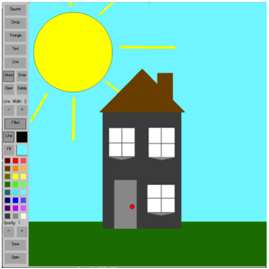

# Firedraw

Firedraw is an drawing application written in c++ and openGL for a module in Computer Graphics at Warwick university. The application draws inspiration from illustrator, allowing users to create lines, shapes and text. Objects can be deleted, resized, rotated and moved after creation, along with setting their fill color & opacity, line color & opactiy and line width. Drawing files can be loaded and saved to file. 

The following keyboard shortcuts are available:
- v : Object move mode
- c : Clear the canvas
- s : Enter draw mode / cycle shape
- q : Quit
- d : Delete selected object

To build the project, navigate to the project directory and use _make_ followed by either _Makefile.linux_ or _Makefile.osx_. Then, the application with _./bin/main_

The project uses pugixml (http://pugixml.org) for xml parsing the applications drawing files. 

